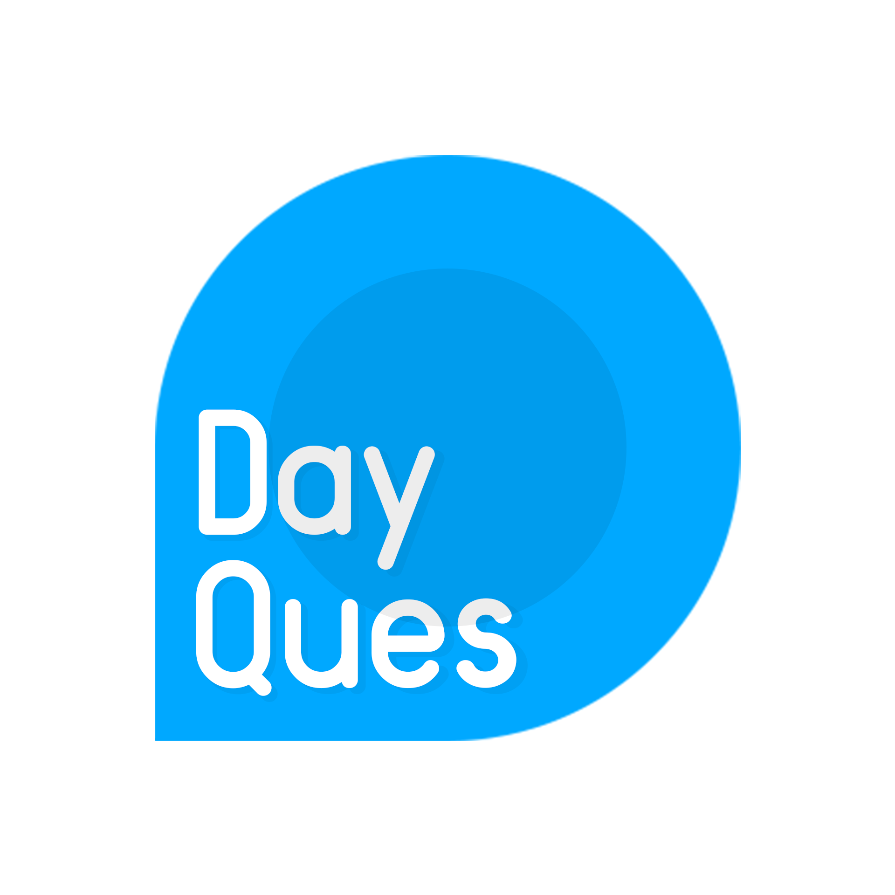

# Вопрос Дня: мобильное приложение мини-социальной сети

  
Мини-социальная сеть "Вопрос дня" - это простое приложение, которое каждый день утром задает пользователю один вопрос (или дать на оценку идею в виде вопроса для размышления). Иногда он шутливый, а порой серьезный. Любой пользователь может ответить на него 
без создания аккаунта, а после узнать ответы других. Понравившийся ответ можно "Оценить" нажав на него. И приложение предоставит небольшую статистику по ответам (сколько людей выбрали те или иные вопросы). Вопрос не обязательно 
задается системой, а может быть придуман и задан определенным (зарегистрированным) пользователем. Предполагается, что такой утренний вопрос будет способствовать формированию настроя на весь оставшийся день. 

  

#### Ключевые особенности:

1. **База данных Firebase:** Приложение использует Realtime Database для хранения, обновления и обработки данных в реальном времени.

2. **Аутентификация и авторизация:** Для обеспечения безопасности данных реализованы механизмы аутентификации и авторизации пользователей.
  
3. **Профили и персонализация:** Пользователь может просматривать свой профиль, редактировать персональные данные, менять фото профиля.

4. **Адаптивный дизайн:** Применяются методы адаптивной верстки, например ConstraintLayout, а также разные ресурсы для разных DPI.

5. **Навигация NavigationAPI:** Применяется компонент BottomNavigationBar в связке с NavigationUI для удобной навигации по приложению.

#### Цель:

Цель проекта - разработать мобильного приложения, которое будет ежедневно задавать пользователям вопросы, способствующие позитивному настрою и активному взаимодействию в рамках 
мини-социальной сети.

#### План разработки:

1.	Исследовать предметную область и провести анализ требований к функционалу;
2.	Разработать концепцию и архитектуру приложения;
3.	Создать макеты и прототипы пользовательского интерфейса;
4.	Реализовать основные функции приложения, включая систему вопросов, ответов и оценок;
5.	Внедрить систему регистрации, профилей пользователей и подписок;
6.	Провести тестирование приложения и устранить обнаруженные ошибки.

#### Скриншоты:

#### Связь со мной:
[Вконтакте](https://vk.com/true_lnz/)
[Телеграм](https://t.me/lansonz/)
